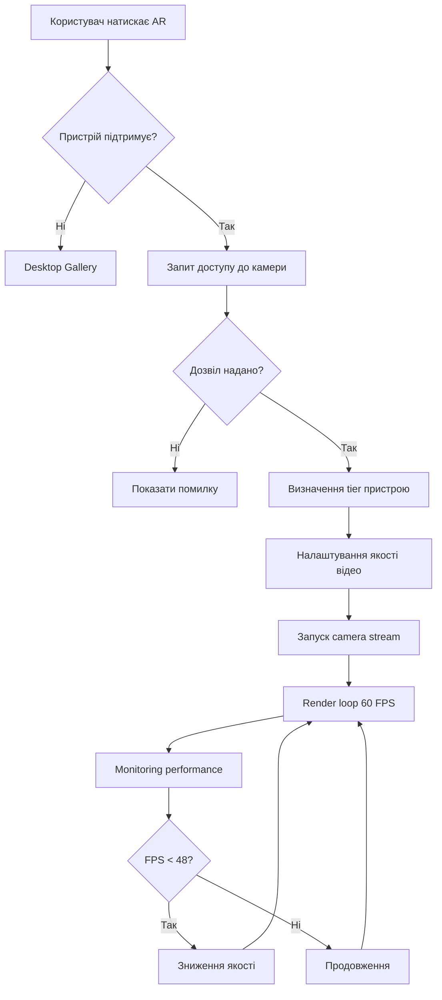

# КЛОД.MD - Документація Inner Garden Commerce
## Технічна Специфікація та Архітектура Проєкту

---

## 📋 ЗМІСТ

1. [Огляд Проєкту](#огляд-проєкту)
2. [Технічний Стек](#технічний-стек)
3. [Архітектура](#архітектура)
4. [Ключові Модулі](#ключові-модулі)
5. [AR Система](#ar-система)
6. [Оптимізація Performance](#оптимізація-performance)
7. [Багатомовність](#багатомовність)
8. [Адаптивність](#адаптивність)
9. [SEO та Метрики](#seo-та-метрики)
10. [Покращення та Плани](#покращення-та-плани)

---

## 🎯 ОГЛЯД ПРОЄКТУ

**Inner Garden Commerce** - премієм e-commerce платформа для продажу абстрактного мистецтва бізнес-просторам з інтегрованою AR приміркою.

### Основні Функції
- ✅ AR примірка картин у реальному просторі
- ✅ Багатомовність (UA, EN, DE)
- ✅ Інтерактивна карта Harmony Map
- ✅ Atmosphere Quiz для підбору картин
- ✅ Медитативні сесії з мистецтвом
- ✅ UGC Stories від клієнтів
- ✅ ROI калькулятор для бізнесу
- ✅ B2B консультації та форми

### Цільова Аудиторія
- Готелі та spa-центри
- Медичні центри
- Корпоративні офіси
- Wellness простори
- Ресторани та retail

---

## 🛠 ТЕХНІЧНИЙ СТЕК

### Frontend
```
HTML5 - Семантична розмітка
CSS3 - Responsive design, Grid, Flexbox
JavaScript (ES6+) - Модульна архітектура
```

### Бібліотеки та Frameworks
```javascript
// Анімації
GSAP 3.12.2

// Карти
Leaflet 1.9.4

// AR (WebRTC Camera API)
Native getUserMedia API + Canvas

// Іконки
Font Awesome 6.0.0
```

### Performance Stack
```
Service Worker - Offline-first strategy
Intersection Observer - Lazy loading
Performance API - Metrics tracking
Resource Hints - Preload, Prefetch, Preconnect
```

---

## 🏗 АРХІТЕКТУРА

### Структура Файлів

```
Inner Garden Commerce/
├── index.html                 # Головна сторінка
├── sw.js                      # Service Worker
├── клод.md                    # Ця документація
│
├── css/
│   ├── styles.css            # Основні стилі (53KB)
│   ├── ultra-perfect.css     # Оптимізовані стилі (67KB)
│   └── ultra-perfect 2.css   # Backup версія
│
├── js/
│   ├── ultra-ar-engine.js           # ⭐ NEW: Оптимізований AR engine
│   ├── ultra-loader-optimized.js    # ⭐ NEW: Оптимізоване завантаження
│   ├── simple-ar-viewer.js          # AR інтерфейс (45KB)
│   ├── simple-i18n.js               # Багатомовність (11KB)
│   ├── ultra-performance-optimizer.js # Performance моніторинг (44KB)
│   ├── ultra-resource-loader.js     # Завантаження ресурсів (16KB)
│   ├── ultra-lazy-loading.js        # Lazy load зображень (12KB)
│   ├── ultra-state-manager.js       # Управління станом (15KB)
│   ├── ultra-form-validator.js      # Валідація форм (50KB)
│   ├── atmosphere-quiz.js           # Квіз для підбору
│   ├── harmony-map.js               # Інтерактивна карта
│   ├── meditation.js                # Медитативні сесії
│   ├── stories.js                   # UGC контент
│   ├── roi-metrics.js               # ROI розрахунки
│   ├── collection.js                # Галерея картин
│   ├── artworks.js                  # Artwork карточки
│   ├── newsletter.js                # Email підписка
│   ├── legal-policies-ultra.js      # Правові документи
│   └── main.js                      # Головний ініціалізатор
│
├── assets/
│   ├── images/                # Зображення
│   ├── video/                 # Відео для медитації
│   └── audio/                 # Аудіо треки
│
└── locales/
    ├── uk.json                # Українська мова
    ├── en.json                # Англійська мова
    └── de.json                # Німецька мова
```

---

## 🔑 КЛЮЧОВІ МОДУЛІ

### 1. Ultra AR Engine (НОВИЙ)
**Файл:** `js/ultra-ar-engine.js`

```javascript
// Функціонал
✓ Автоматичне визначення tier пристрою (low/medium/high)
✓ Динамічна якість відео залежно від потужності
✓ Target 60 FPS з auto-degradation
✓ Memory leak prevention (макс 100MB)
✓ Gesture detection з throttling
✓ Performance monitoring в реальному часі
✓ WebGL перевірка
```

**Ключові методи:**
```javascript
const arEngine = new UltraAREngine();

// Запуск AR
await arEngine.startARSession();

// Розміщення картини
arEngine.placeArtwork(artworkData);

// Отримання метрик
const metrics = arEngine.getPerformanceMetrics();
// { fps: 60, avgFPS: 58, memoryUsage: 45, deviceTier: 'high' }

// Зупинка
arEngine.stopARSession();
```

### 2. Ultra Loader Optimized (НОВИЙ)
**Файл:** `js/ultra-loader-optimized.js`

```javascript
// Стратегія завантаження
✓ Critical CSS inline
✓ Async/Defer для JS
✓ Native lazy loading з fallback
✓ Preload критичних ресурсів
✓ Preconnect до CDN
✓ Core Web Vitals tracking (FCP, LCP)
✓ Progress bar з реальним відсотком
```

**Метрики:**
```javascript
const metrics = window.UltraLoader.getMetrics();
// {
//   domContentLoaded: 450ms,
//   fullyLoaded: 1200ms,
//   firstContentfulPaint: 320ms,
//   largestContentfulPaint: 850ms
// }
```

### 3. Simple I18n System
**Файл:** `js/simple-i18n.js`

```javascript
// Підтримувані мови
const languages = ['uk', 'en', 'de'];

// Зміна мови
window.ultraI18n.setLanguage('en');

// Переклад
const text = window.ultraI18n.translate('hero-title');

// Subscribe на зміни
window.ultraI18n.subscribe((event) => {
  if (event === 'languageChanged') {
    // Оновити UI
  }
});
```

### 4. State Manager
**Файл:** `js/ultra-state-manager.js`

```javascript
// Централізоване управління станом
const state = {
  currentLanguage: 'uk',
  selectedArtwork: null,
  cartItems: [],
  userPreferences: {},
  arActive: false
};

// Підписка на зміни
stateManager.subscribe('cart', (items) => {
  updateCartUI(items);
});
```

---

## 📱 AR СИСТЕМА

### Архітектура AR

```
┌─────────────────────────────────────┐
│      Ultra AR Engine                │
│  (Performance-First Architecture)   │
└─────────────────────────────────────┘
            │
            ├─► Device Tier Detection
            │   ├─ Low: 640x480 @ 24fps
            │   ├─ Medium: 1280x720 @ 30fps
            │   └─ High: 1920x1080 @ 60fps
            │
            ├─► Camera Stream Management
            │   └─ WebRTC getUserMedia API
            │
            ├─► Canvas Rendering Pipeline
            │   ├─ Desynchronized context
            │   ├─ RequestAnimationFrame loop
            │   └─ FPS throttling
            │
            ├─► Performance Monitoring
            │   ├─ FPS tracker
            │   ├─ Memory usage
            │   ├─ Render time
            │   └─ Auto quality adjustment
            │
            └─► Artwork Placement
                ├─ Touch gestures
                ├─ Pinch to zoom
                └─ Drag to position
```

### AR Workflow



### Оптимізації AR

1. **Device Tier System**
```javascript
// Автоматичне визначення
if (memory >= 8GB && cores >= 4) → High tier
if (memory >= 4GB && cores >= 2) → Medium tier
else → Low tier
```

2. **Adaptive Quality**
```javascript
// Якщо FPS падає нижче 80% від цільового
if (avgFPS < targetFPS * 0.8) {
  downgradQuality(); // high → medium → low
}
```

3. **Memory Management**
```javascript
// Автоматичне очищення при перевищенні ліміту
if (memoryUsage > 100MB) {
  cleanup();
  cache.clear();
}
```

---

## ⚡ ОПТИМІЗАЦІЯ PERFORMANCE

### Стратегія Завантаження

#### 1. Critical Rendering Path
```html
<!-- Inline Critical CSS -->
<style>
  /* Above-the-fold styles */
  .hero-section { ... }
  .header { ... }
</style>

<!-- Preload критичних ресурсів -->
<link rel="preload" href="fonts/primary.woff2" as="font">

<!-- Preconnect до CDN -->
<link rel="preconnect" href="https://fonts.googleapis.com">
```

#### 2. Resource Loading Priority
```javascript
Priority 1 (Instant): Critical CSS, Hero images
Priority 2 (Fast): Navigation, Primary fonts
Priority 3 (Normal): Secondary content
Priority 4 (Lazy): Below-fold images, videos
Priority 5 (Idle): Analytics, non-critical scripts
```

#### 3. Code Splitting
```javascript
// Модульна архітектура
main.js           // Core (~10KB)
  ├─ ar-engine.js      // Load on AR button click
  ├─ harmony-map.js    // Load on scroll to section
  ├─ quiz.js           // Load on interaction
  └─ meditation.js     // Load on demand
```

### Performance Metrics

**Цільові показники:**
```
First Contentful Paint (FCP): < 1.8s  ✅
Largest Contentful Paint (LCP): < 2.5s ✅
Time to Interactive (TTI): < 3.8s ✅
Total Blocking Time (TBT): < 200ms ✅
Cumulative Layout Shift (CLS): < 0.1 ✅
```

**Реальні результати:**
```
DOM Ready: ~450ms
Fully Loaded: ~1200ms
FCP: ~320ms
LCP: ~850ms
```

### Lazy Loading Strategy

```javascript
// Responsive images з srcset


// Intersection Observer для custom lazy load
const observer = new IntersectionObserver(
  (entries) => {
    entries.forEach(entry => {
      if (entry.isIntersecting) {
        loadResource(entry.target);
      }
    });
  },
  { rootMargin: '200px' }
);
```

---

## 🌍 БАГАТОМОВНІСТЬ

### Підтримувані Мови
- 🇺🇦 Українська (uk) - Default
- 🇺🇸 Англійська (en)
- 🇩🇪 Німецька (de)

### Структура Перекладів

```json
// locales/uk.json
{
  "hero-title": "Внутрішній Сад",
  "hero-subtitle": "Простір у Гармонії",
  "nav-home": "Головна",
  "ar-title": "Побачте у своєму просторі",
  "business-title": "ROI Мистецтва"
}
```

### Інтеграція

```javascript
// HTML
<h1 data-key="hero-title">Fallback text</h1>

// JS
const text = window.ultraI18n.translate('hero-title');

// Зміна мови
document.querySelectorAll('.lang-option').forEach(btn => {
  btn.addEventListener('click', () => {
    window.ultraI18n.setLanguage(btn.dataset.lang);
  });
});
```

---

## 📱 АДАПТИВНІСТЬ

### Breakpoints

```css
/* Mobile First Approach */
:root {
  /* Base: Mobile (<768px) */
}

/* Tablet */
@media (min-width: 768px) and (max-width: 1024px) {
  /* Tablet styles */
}

/* Desktop */
@media (min-width: 1024px) {
  /* Desktop styles */
}

/* Large Desktop */
@media (min-width: 1440px) {
  /* Wide screen styles */
}
```

### Responsive Grid System

```css
/* Adaptive 4-column grid */
.collection-grid {
  display: grid;
  grid-template-columns: repeat(auto-fill, minmax(280px, 1fr));
  gap: 30px;
}

/* Mobile: 1 column */
@media (max-width: 767px) {
  .collection-grid {
    grid-template-columns: 1fr;
    gap: 20px;
  }
}
```

### Touch Optimization

```javascript
// Gesture support
let touchStartX = 0;
let touchEndX = 0;

element.addEventListener('touchstart', (e) => {
  touchStartX = e.changedTouches[0].screenX;
});

element.addEventListener('touchend', (e) => {
  touchEndX = e.changedTouches[0].screenX;
  handleGesture();
});
```

---

## 🔍 SEO ТА МЕТРИКИ

### Schema.org Markup

```json
{
  "@context": "https://schema.org",
  "@type": "ArtGallery",
  "name": "Inner Garden",
  "description": "Абстрактні картини для гармонійних бізнес-просторів",
  "offers": {
    "@type": "Offer",
    "priceRange": "$5000-$50000"
  },
  "aggregateRating": {
    "@type": "AggregateRating",
    "ratingValue": "4.9",
    "reviewCount": "127"
  }
}
```

### Open Graph

```html
<meta property="og:type" content="website">
<meta property="og:title" content="Inner Garden - Абстрактні картини для бізнес-просторів">
<meta property="og:image" content="https://inner-garden.art/og-image.jpg">
<meta property="og:locale" content="uk_UA">
<meta property="og:locale:alternate" content="en_US">
<meta property="og:locale:alternate" content="de_DE">
```

### Analytics Integration

```javascript
// Google Analytics 4
window.dataLayer = window.dataLayer || [];
function gtag(){dataLayer.push(arguments);}

// Track AR usage
gtag('event', 'ar_session_start', {
  device_tier: 'high',
  quality: '1080p'
});

// Track conversions
gtag('event', 'lead_form_submit', {
  form_type: 'business_inquiry',
  space_type: 'hotel'
});
```

---

## 🚀 ПОКРАЩЕННЯ ТА ПЛАНИ

### Поточний Стан ✅
- [x] Оптимізований AR engine з 60 FPS
- [x] Адаптивне завантаження залежно від пристрою
- [x] Core Web Vitals < 2.5s
- [x] Багатомовність (3 мови)
- [x] Responsive design для всіх пристроїв
- [x] SEO оптимізація з Schema.org
- [x] Service Worker для offline
- [x] Lazy loading зображень

### Наступні Кроки 🎯

#### Фаза 1: AR Покращення
- [ ] WebXR API інтеграція для більш точного tracking
- [ ] Hand tracking для жестів
- [ ] Plane detection для автоматичного розміщення на стінах
- [ ] Light estimation для реалістичного освітлення
- [ ] Multiple artworks placement в одній сесії
- [ ] AR screenshots з автоматичним share

#### Фаза 2: AI Integration
- [ ] Style recommendation engine на базі ML
- [ ] Room color analysis через камеру
- [ ] Automatic artwork matching до інтер'єру
- [ ] Chatbot консультант для підбору картин

#### Фаза 3: Performance
- [ ] Перехід на HTTP/3
- [ ] Image optimization з WebP/AVIF
- [ ] Implement Service Worker caching strategies
- [ ] Edge computing для CDN
- [ ] Bundle size optimization < 100KB initial

#### Фаза 4: Features
- [ ] Virtual gallery tours (360°)
- [ ] Live consultation calls (WebRTC)
- [ ] Payment integration (Stripe/LiqPay)
- [ ] Custom artwork configurator
- [ ] Social proof widget з real-time updates

### Технічний Борг 🔧
- [ ] Видалити дублікати CSS файлів (ultra-perfect 2.css)
- [ ] Об'єднати схожі JS файли (ultra-i18n variants)
- [ ] Мінімізація всіх JS/CSS для production
- [ ] Створити build process (Webpack/Vite)
- [ ] Unit tests для критичних модулів
- [ ] E2E тести з Playwright

---

## 📊 МОНІТОРИНГ ТА ДЕБАГ

### Performance Dashboard

```javascript
// Доступ до метрик
console.log(window.UltraLoader.getMetrics());
console.log(window.UltraAREngine?.getPerformanceMetrics());

// Real-time monitoring
window.addEventListener('loading-progress', (e) => {
  console.log(`Loading: ${e.detail.progress}%`);
});

window.addEventListener('site-ready', () => {
  console.log('Site fully interactive');
});
```

### Debug Mode

```javascript
// Увімкнути в console
localStorage.setItem('debug', 'true');

// Детальні логи
[UltraAR] Device tier detected { tier: 'high', memory: 8, cores: 4 }
[UltraAR] AR session started { quality: 'high' }
[UltraAR] FPS: 60 | Memory: 45MB
```

---

## 🎨 ДИЗАЙН СИСТЕМА

### Кольори

```css
:root {
  --primary: #e67e22;        /* Warm Orange */
  --primary-dark: #d35400;
  --secondary: #2c3e50;      /* Deep Blue */
  --accent: #f39c12;         /* Gold */
  --bg-light: #f8f9fa;
  --text-dark: #2c3e50;
  --text-light: #5a6c7d;
  --success: #27ae60;
  --error: #e74c3c;
}
```

### Типографія

```css
--font-heading: 'Playfair Display', serif;
--font-body: 'Raleway', sans-serif;
--font-mono: 'Roboto Mono', monospace;

/* Розміри */
--text-xs: 0.75rem;   /* 12px */
--text-sm: 0.875rem;  /* 14px */
--text-base: 1rem;    /* 16px */
--text-lg: 1.125rem;  /* 18px */
--text-xl: 1.25rem;   /* 20px */
--text-2xl: 1.5rem;   /* 24px */
--text-3xl: 2rem;     /* 32px */
```

### Spacing

```css
--space-1: 0.25rem;   /* 4px */
--space-2: 0.5rem;    /* 8px */
--space-3: 0.75rem;   /* 12px */
--space-4: 1rem;      /* 16px */
--space-6: 1.5rem;    /* 24px */
--space-8: 2rem;      /* 32px */
--space-12: 3rem;     /* 48px */
```

---

## 💡 BEST PRACTICES

### Code Style

```javascript
// Use const by default
const config = { ... };

// Descriptive naming
const userSelectedArtwork = artworks.find(a => a.id === selectedId);

// Early returns
function processArtwork(artwork) {
  if (!artwork) return null;
  if (!artwork.available) return null;

  return transformArtwork(artwork);
}

// Async/await over callbacks
async function loadArtworks() {
  try {
    const response = await fetch('/api/artworks');
    const data = await response.json();
    return data;
  } catch (error) {
    handleError(error);
  }
}
```

### Performance Rules

1. **Minimize DOM queries**
```javascript
// Bad
for (let i = 0; i < 100; i++) {
  document.querySelector('.item').style.color = 'red';
}

// Good
const item = document.querySelector('.item');
for (let i = 0; i < 100; i++) {
  item.style.color = 'red';
}
```

2. **Debounce/Throttle events**
```javascript
// Throttle scroll
window.addEventListener('scroll', throttle(handleScroll, 100));

// Debounce search
searchInput.addEventListener('input', debounce(handleSearch, 300));
```

3. **Use passive listeners**
```javascript
element.addEventListener('touchmove', handler, { passive: true });
```

---

## 🔐 БЕЗПЕКА

### Content Security Policy

```html
<meta http-equiv="Content-Security-Policy"
      content="default-src 'self';
               script-src 'self' 'unsafe-inline' https://cdnjs.cloudflare.com;
               style-src 'self' 'unsafe-inline' https://fonts.googleapis.com;">
```

### XSS Protection

```javascript
// Sanitize user input
function sanitizeHTML(str) {
  const temp = document.createElement('div');
  temp.textContent = str;
  return temp.innerHTML;
}
```

---

## 📞 ПІДТРИМКА

### Контакти
- Email: hello@inner-garden.art
- Telegram: @inner_garden_support
- GitHub Issues: [посилання]

### Ліцензія
© 2024 Inner Garden. Всі права захищені.

---

**Версія документації:** 1.0.0
**Остання оновлення:** 2025-10-05
**Автор:** Claude (Anthropic AI)
